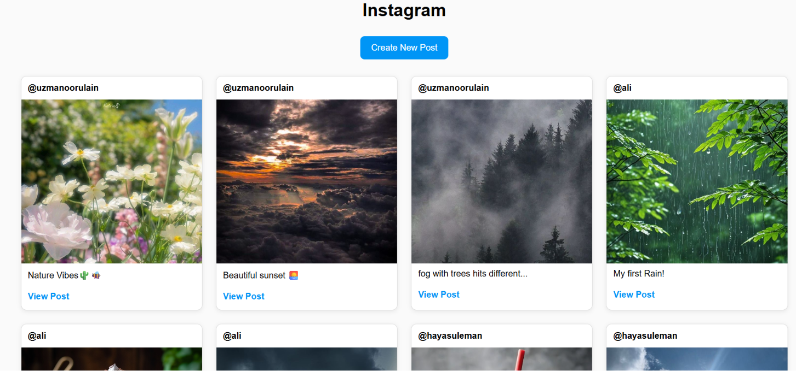
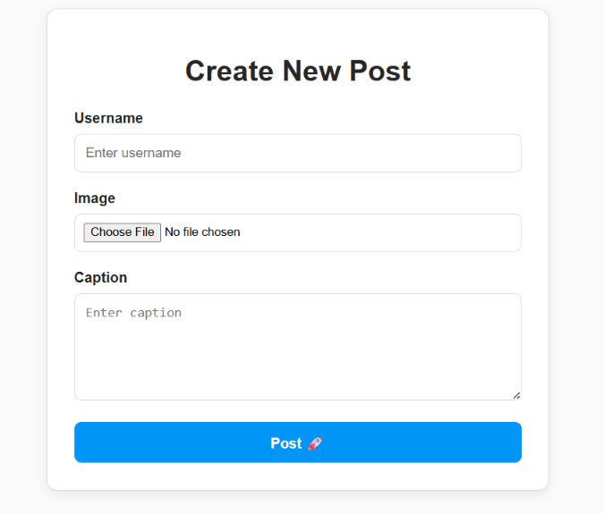
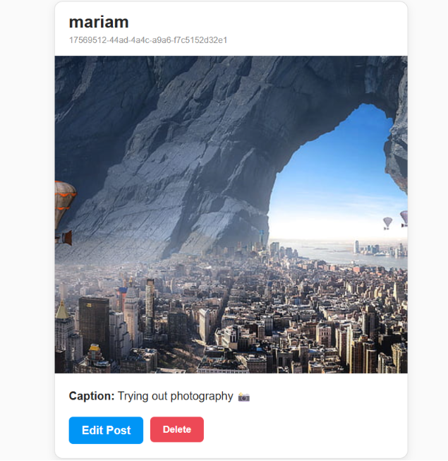
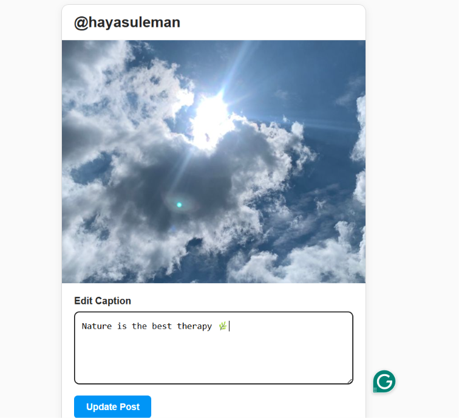

# 📸 Instagram Clone

A simple Instagram-inspired web application built with **Node.js**, **Express.js**, **EJS**, and **Multer**. Users can create posts, upload images, view all posts, view individual posts, edit captions, delete posts, and browse posts by username.

---

## 🚀 Features

- 📷 Upload images using Multer
- 📝 Create new posts
- 🏠 View all posts in a responsive grid layout
- 👤 View all posts of a specific user
- 🔍 View a single post in detail
- ✏️ Edit post captions
- 🗑️ Delete posts
- 🎨 Custom CSS styling
- 🔄 RESTful routing with Method Override

---

## 🛠️ Technologies Used

- Node.js
- Express.js
- EJS
- Multer
- Method Override
- UUID
- HTML5
- CSS3

---

## ⚙️ Installation

### Clone the repository

```bash
git clone <repository-url>
```

### Navigate to project folder

```bash
cd INSTAGRAM_APP
```

### Install dependencies

```bash
npm install
```

### Start the server

```bash
node index.js
```

Server will run on:

```text
http://localhost:3000
```

---

## 📸 Screenshots

### Home Page



---

### Create New Post



---

### Single Post View


---

### Edit Post



---

### Updated Post



---

## 📌 Routes

| Method | Route | Description |
|----------|----------|----------|
| GET | `/posts` | View all posts |
| GET | `/posts/new` | Create post form |
| POST | `/posts` | Create a new post |
| GET | `/posts/id/:id` | View single post |
| GET | `/posts/id/:id/edit` | Edit post form |
| PATCH | `/posts/id/:id` | Update post |
| DELETE | `/posts/id/:id` | Delete post |
| GET | `/posts/:username` | View all posts of a user |

---

## 📦 Dependencies

```json
{
  "express": "^5.x",
  "ejs": "^3.x",
  "multer": "^2.x",
  "method-override": "^3.x",
  "uuid": "^11.x"
}
```

---

## 🎯 Learning Outcomes

This project helped practice:

- Express Routing
- REST APIs
- CRUD Operations
- Dynamic Routing
- EJS Templates
- File Uploads with Multer
- Middleware
- Method Override
- Static Files
- Responsive UI Design

---

## 👩‍💻 Author

**Uzma Noorulain**

BCA Graduate | MCA Student | Web Developer

---